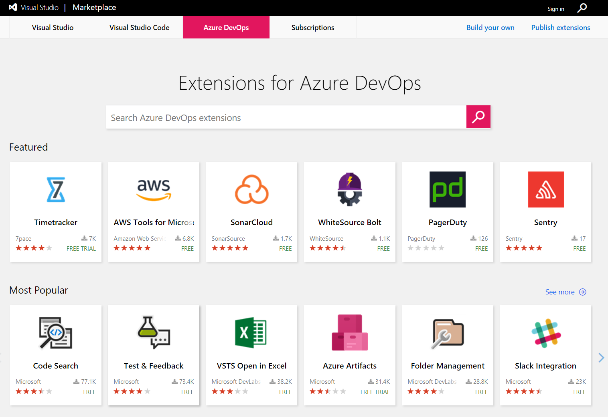

## Ensuring quality in your DevOps pipelines using Cake

### _An introduction to Cake.Issues_

@snap[south]
@css[bio-tagline](Pascal Berger, BBT Software AG)
<br>
@fa[twitter pad-fa bio-tagline] @css[bio-tagline](@hereispascal)
@snapend

---

## Agenda

* What we want to achieve
* Quick introduction to Cake
* Overview of Cake.Issues
* Reading issues
* Creating reports
* Integration in pull request workflow
* What else

---

## What we want to achieve

---

## What we have


---

## Add static code analysis


Ensure code quality through static code analysis

Integrated into build process

---

## Break build if quality requirements are not met


Enforce guidelines

---

## Create reports


Overview about issues

---


---

## Integrate with pull requests


Fast feedback for developers

Pull request reviews should focus on business issues

---
  


---

## Azure DevOps Marketplace



* Hundreds of extensions providing additional build tasks
* Easy to click to together in the UI

---

## Issue with extensions #1

* It depends on Azure DevOps
* Doesn't work locally (without additional infrastructure)

---

## Issue with extension #2

* Having logic in pipelines doesn't scale to hundreds of pipelines
* YML based pipelines help but you still have redundancy

---

## Issue with extension #3

* Never trust anything running code in your build pipeline
* Auto update is a huge security & reliability issue

---

## Our approach

* Independence of tools
* Same script for build server & local
* Easy to scale for a lot of pipelines
* Extensible to future use cases
* Secure & reliable
* Easy to maintain
* Open source

---

## Quick introduction to Cake

---

### What is Cake

* A build automation tool
* Allows to write build scripts in C#
* DSL can be extended through addins
* Build scripts can be shared as NuGet packages
* Open source project part of .NET Foundation
* https://cakebuild.net/

---

### Sample Cake file

```csharp
//////////////////////////////////////////////////////////////////////
// ARGUMENTS
//////////////////////////////////////////////////////////////////////

var target = Argument("target", "Default");
var configuration = Argument("configuration", "Release");

//////////////////////////////////////////////////////////////////////
// PREPARATION
//////////////////////////////////////////////////////////////////////

// Define directories.
var repoRootFolder =
    MakeAbsolute(Directory("./"));
var outputFolder =
    repoRootFolder.Combine("output");
var solutionFile =
    repoRootFolder
        .Combine("src")
        .CombineWithFilePath("Example.sln");

//////////////////////////////////////////////////////////////////////
// TASKS
//////////////////////////////////////////////////////////////////////

Task("Clean")
    .Does(() =>
{
    CleanDirectory(buildDir);
});

Task("Restore-NuGetPackages")
    .IsDependentOn("Clean")
    .Does(() =>
{
    NuGetRestore(solutionFile);
});

Task("Build")
    .IsDependentOn("Restore-NuGetPackages")
    .Does(() =>
{
    MSBuild(
        solutionFile,
        settings =>
            settings.SetConfiguration(configuration));
});

//////////////////////////////////////////////////////////////////////
// TASK TARGETS
//////////////////////////////////////////////////////////////////////

Task("Default")
    .IsDependentOn("Build");

//////////////////////////////////////////////////////////////////////
// EXECUTION
//////////////////////////////////////////////////////////////////////

RunTarget(target);
```

@[5-6](Parse arguments which can be passed to the build script)
@[13-20](Set some variables for directories and files)
@[26-30](Task to clean the output directory)
@[32-37](Task to restore NuGet packages)
@[39-47](Task to build solution)
@[53-54](Task executed by default)
@[60](Execute build script)

---

### What are addins

* Addins can extend DSL by providing additional aliases
* Distributed as NuGet packages
* Over 250 open source addins available
* https://cakebuild.net/addins/

---

### Using addins

```csharp
#addin nuget:?package=Cake.Issues&version=x.y
```

* Always pin to a specific version to have deterministic builds
* Make sure you trust the addins which you're using

---

## Overview of Cake.Issues

---

### Cake.Issues features

* Issue Management for the Cake Build System
* Read issues from different linters
* Create reports
* Report issues to pull requests and build systems

---

### Cake.Issues features

* Over 10 addins providing more than 50 aliases
* Extensible through custom addins
* Open Source
* https://cake-contrib.github.io/Cake.Issues.Website/

---

@snap[north]

<h3>Architecture<h3>

@snapend

@snap[south architecture fragment]

@snapend

@snap[south-west architecture fragment]

@snapend

@snap[south-east architecture fragment]

@snapend

---

## Reading issues

---

### Issue providers

* Responsible for providing issues from output of linter or tool
* Specific issue providers separated from core logic
* Issue providers can support multiple formats

---

### Available issue providers

* MsBuild
* InspectCode / ReSharper
* ESLint
* Markdownlint
* DocFx

---

### How to parse linting output

```csharp
#addin "Cake.Issues"
#addin "Cake.Issues.InspectCode"

Task("Read-Issues").Does(() =>
{
    var settings =
        new ReadIssuesSettings(new DirectoryPath(@"C:\repo"))
        {
            Format = IssueCommentFormat.Markdown
        };

    var issues =
        ReadIssues(
            InspectCodeIssuesFromFilePath(
                @"C:\build\inspectcode.log"),
            settings);

    Information("{0} issues are found.", issues.Count());
});
```

@[1](Add the core addin)
@[2](Add specific issue provider implementation)
@[4-5](Add task for reading issues)
@[6-10](Define settings for reading issues)
@[12-16](Read issues)
@[18](Output number of issues found)

---

### IIssue interface

Abstraction over different issue providers

```csharp
public interface IIssue
{
    FilePath ProjectFileRelativePath { get; }

    string ProjectName { get; }

    FilePath AffectedFileRelativePath { get; }

    int? Line { get; }

    string Message { get; }

    int? Priority { get; }

    string PriorityName { get; }

    string Rule { get; }

    Uri RuleUrl { get; }

    string ProviderType { get; }

    string ProviderName { get; }
}
```

@[3-5](Project information)
@[7](File information)
@[9](Line information)
@[11](Message)
@[13-15](Issue priority)
@[17-19](Rule information)
@[21-23](Provider information)

---

### How to break builds

```csharp
var errors =
    issues.Any(x => x.Priority == IssuePriority.Error);

if (errors.Any())
{
    throw new Exception(
        string.Format(
            "Found {0} errors while analyzing solution",
            errors.Count()
        )
    )
}
```

@[1-2](Determine issues which are errors)
@[4-12](Throw exception to stop build script)

---

## Creating reports

---
  
### Report formats

* Responsible for creating reports
* Specific report formats separated from core logic

---
  
### Available report formats

* Generic format using Razor templates
  * Out of the box templates (e.g. DevExtreme)
  * Support for custom templates

---
  
### Demo integration in Azure Pipelines

https://dev.azure.com/pberger/Cake.Issues-Demo

Note:

* DevExtreme report as artifact
* Custom build summary report

---

## Integration in pull request workflow

---
  
### Pull request & build systems

* Responsible for communicating with pull request or build systems
* Filter to relevant issues
* Auto-reopen or resolve comment threads
* Specific pull request systems separated from core logic

---
  
### Available pull request & build systems

* Team Foundation Server / Azure DevOps
* AppVeyor

---

### Demo integration in Azure Pipelines

https://dev.azure.com/pberger/Cake.Issues-Demo

Note:

* Status of issues / numbers.
* Report issues as comments to pull requests.
* Automatic resolving of issues fixed in subsequent commits.
* Automatic reopening of still existing issues which are already closed on pull request.

---

## What else

---

### Using with GitHub

* On public GitHub repositories we cannot integrate with pull requests due to security issues
* Integration with AppVeyor available
  https://github.com/pascalberger/cake.issues-demo/

---

### Possible use cases

* Web linters (StyleLint, TSLint, WebHint, ...)
* Docker file linting
* Report security vulnerabilities through [Sonatype OSS Index](https://ossindex.net)
* Report NuGet package updates
* Any issue which you determine in your build script can be reported

---

### Alternatives

* [SonarQube with Azure DevOps / TFS extension](https://docs.sonarqube.org/display/SCAN/Analyzing+with+SonarQube+Extension+for+VSTS-TFS)
  * All languages supported by SonarQube with Azure DevOps / TFS
* [Build Cross Check](https://github.com/apps/build-cross-check)
  * MsBuild binary logs with GitHub

---

## Resources

* Documentation & Examples:
  
  https://cake-contrib.github.io/Cake.Issues.Website
* Source code:
  
  https://github.com/topics/cake-issues
* Reach out:
  
  @fa[twitter pad-fa] @hereispascal