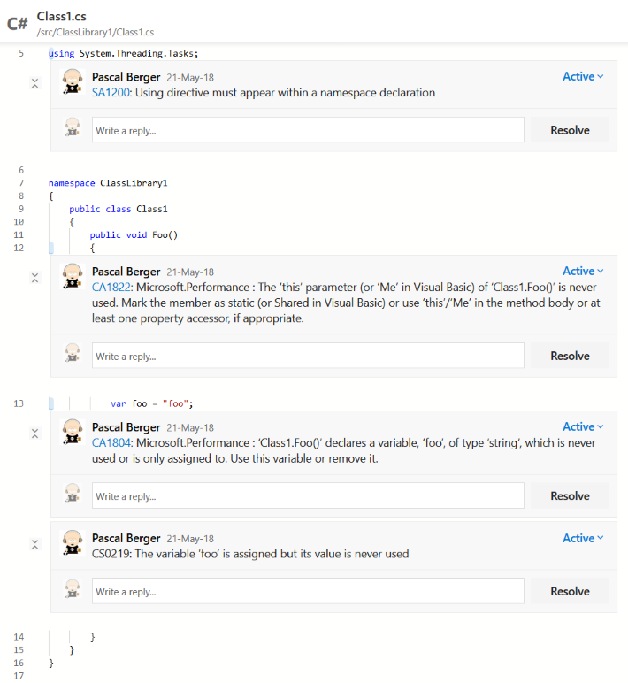

## Continuous Code Inspection using Cake

### _An introduction to Cake.Issues_

@snap[south]
@css[bio-tagline](Pascal Berger, BBT Software AG)
<br>
@fa[twitter pad-fa bio-tagline] @css[bio-tagline](@hereispascal)
@snapend

---

## About me

Software Architect at BBT Software AG<br/>
Microsoft MVP<br/>
Open Source Maintainer<br/>


@snap[south bio-tagline]
@fa[twitter pad-fa] @hereispascal<br/>
@fa[github pad-fa bio-tagline] github.com/pascalberger<br/>
@fa[envelope pad-fa bio-tagline] pascal@cakebuild.net
@snapend

---

@snap[west span-50]
<h3>Topics to be covered</h3>
@snapend

@snap[east span-45]
@ol[split-screen-list text-08](false)
* Continuous Inspection
* Introduction to Cake
* Overview of Cake.Issues
* Reading issues
* Creating reports
* Integration in pull request workflow
* Recipe script
@olend
@snapend

---

## Continuous Inspection

---

### Standard build pipeline


---

### Add static code analysis


Ensure code quality through static code analysis

Integrated into build process

---

### Break build if quality requirements are not met


Enforce guidelines

---

### Create reports


Overview about issues

---


---

### Integrate with pull requests


Fast feedback for developers

Pull request reviews should focus on business issues

---



---

## Introduction to Cake


---

### Manual deployments

* Risky
  * Prone to human error
  * Might depend on specific environment
* Low bus factor
  * Might depend on single person

---

### Defining pipelines on build server

* Vendor lock in to CI server
* Doesn't work easily locally
* Hard to debug
* Hard to scale to a lot of repositories
* Hard to maintain
* Using extensions is a trust & security issue
* Loose of control: Server / extension update affects build

---

### What is Cake

* A build automation tool
* Allows to write build scripts in C#
* Powered by Roslyn
* Open source project part of .NET Foundation
* https://cakebuild.net/

---

### Why use Cake

* Everything you can do with .NET you can do in Cake
* Cross-Plattform
  * Windows, Linux, macOS, Docker
* Cross-Framework
  * Runs on .NET Framework 4.6.1, Mono 4.4.2 and .NET Core 2.1
* Cross-Environment
  * Out of the box support for different build servers
* Out of the box support for a lot of tools
* Healthy community

---

### How does Cake work

* Cake file
  * By convention called `build.cake`
  * Contains build script logic
* Bootstrapper
  * PowerShell (`build.ps1`) or Bash (`build.sh`) script
  * Responsible for installing dependencies and to run Cake

---

### Dependency based programming


---

### Sample Cake file

```csharp
//////////////////////////////////////////////////////////////////////
// ARGUMENTS
//////////////////////////////////////////////////////////////////////

var target = Argument("target", "Default");
var configuration = Argument("configuration", "Release");

//////////////////////////////////////////////////////////////////////
// PREPARATION
//////////////////////////////////////////////////////////////////////

// Define directories.
var repoRootFolder =
    MakeAbsolute(Directory("./"));
var outputFolder =
    repoRootFolder.Combine("output");
var solutionFile =
    repoRootFolder
        .Combine("src")
        .CombineWithFilePath("Example.sln");

//////////////////////////////////////////////////////////////////////
// TASKS
//////////////////////////////////////////////////////////////////////

Task("Clean")
    .Does(() =>
{
    CleanDirectory(buildDir);
});

Task("Restore-NuGetPackages")
    .Does(() =>
{
    NuGetRestore(solutionFile);
});

Task("Build")
    .IsDependentOn("Clean")
    .IsDependentOn("Restore-NuGetPackages")
    .Does(() =>
{
    MSBuild(
        solutionFile,
        settings =>
            settings.SetConfiguration(configuration));
});

//////////////////////////////////////////////////////////////////////
// TASK TARGETS
//////////////////////////////////////////////////////////////////////

Task("Default")
    .IsDependentOn("Build");

//////////////////////////////////////////////////////////////////////
// EXECUTION
//////////////////////////////////////////////////////////////////////

RunTarget(target);
```

@[5-6](Parse arguments which can be passed to the build script. Argument is a Cake alias.)
@[12-20](Set some variables for directories and files. Cake provides file system abstraction.)
@[26-30](Task to clean the output directory.)
@[32-36](Task to restore NuGet packages)
@[38-47](Task to build solution)
@[53-54](Task executed by default)
@[60](Execute build script)

---

### Extensibility

* DSL can be extended through addins
* Build scripts can be shared as NuGet packages

---

### What are addins

* Addins can extend DSL by providing additional aliases
* Distributed as NuGet packages
* Over 250 open source addins available
* https://cakebuild.net/addins/

---

### Using addins

```csharp
#addin nuget:?package=Cake.Issues&version=x.y
```

* Always pin to a specific version to have deterministic builds
* Make sure you trust the addins which you're using

---

### Writing addins

* .NET Assemblies
* Aliases are extension methods of `ICakeContext`
* Require `CakeMethodAlias` attribute

```csharp
[CakeMethodAlias]
public static IEnumerable<IIssue> ReadIssues(
    this ICakeContext context)
```

---

## Overview of Cake.Issues

---

### Cake.Issues features

* Issue Management for the Cake Build System
* Read issues from different linters
* Create reports
* Report issues to pull requests and build systems

---

### Cake.Issues features

* Over 10 addins providing more than 75 aliases
* Extensible through custom addins
* Open Source
* https://cakeissues.net

---

@snap[north]

<h3>Architecture<h3>

@snapend

@snap[south architecture fragment]

@snapend

@snap[south-west architecture fragment]

@snapend

@snap[south-east architecture fragment]

@snapend

---

## Reading issues

---

### Issue providers

* Responsible for providing issues from output of linter or tool
* Specific issue providers separated from core logic
* Issue providers can support multiple formats

Note:

* Full feature list: https://cakeissues.net/docs/overview/features#cake.issues

---

### Available issue providers

* MsBuild
* InspectCode / ReSharper
* DupFinder
* ESLint
* Markdownlint
* DocFx
* Git repository analysis

---

### Possible other issue providers

* Web linters (StyleLint, TSLint, WebHint, ...)
* Docker file linting
* Report security vulnerabilities
* Report NuGet package updates
* Any issue which you determine in your build script can be reported

---

### How to parse linting output

```csharp
#addin "Cake.Issues"
#addin "Cake.Issues.InspectCode"

Task("Read-Issues")
    .IsDependentOn("Run-InspectCode")
    .Does(() =>
{
    var repoRootPath = new DirectoryPath(@"C:\repo");
    var inspectCodeLogPath = @"C:\build\inspectcode.log";

    IEnumerable<IIssue> issues =
        ReadIssues(
            InspectCodeIssuesFromFilePath(inspectCodeLogPath),
            repoRootPath);

    Information("{0} issues are found.", issues.Count());
});
```

@[1](Add the core addin)
@[2](Add specific issue provider implementation)
@[4-7](Add task for reading issues. Run-InspectCode is a task running InspectCode analysis)
@[8-9](Define variables for files and directories)
@[11-14](Read issues)
@[16](Output number of issues found)

---

### IIssue interface

Abstraction over different issue providers

```csharp
public interface IIssue
{
    string Identifier { get; }

    FilePath ProjectFileRelativePath { get; }

    string ProjectName { get; }

    FilePath AffectedFileRelativePath { get; }

    int? Line { get; }

    int? EndLine { get; }

    int? Column { get; }

    int? EndColumn { get; }

    Uri FileLink { get; }

    string MessageText { get; }

    string MessageMarkdown { get; }

    string MessageHtml { get; }

    int? Priority { get; }

    string PriorityName { get; }

    string Rule { get; }

    Uri RuleUrl { get; }

    string Run { get; }

    string ProviderType { get; }

    string ProviderName { get; }
}
```

@[3](Identifier of issue)
@[5-7](Project information)
@[9](File information)
@[11-17](Line & column information)
@[19](Link to file on source code hosting platform)
@[21-25](Message in different formats)
@[27-29](Issue priority)
@[31-33](Rule information)
@[35](Run information)
@[37-39](Provider information)

---

### How to store state between tasks

Introducing typed context

```csharp
public class BuildData
{
    private readonly List<IIssue> issues = new List<IIssue>();

    public IEnumerable<IIssue> Issues =>
        issues.AsReadOnly();

    public void AddIssues(IEnumerable<IIssue> issues) =>
        this.issues.AddRange(issues);
}

Setup<BuildData>(context =>
{
    return new BuildData();
});
```

@[1-10](Add typed context class for holding build state. This is a standard C# class.)
@[12-15](Setup typed context)

---

### Store issues in typed context

```csharp
Task("Read-Issues").Does<BuildData>(data =>
{
    var repoRootPath = new DirectoryPath(@"C:\repo");
    var inspectCodeLogPath = @"C:\build\inspectcode.log";

    IEnumerable<IIssue> issues =
        ReadIssues(
            InspectCodeIssuesFromFilePath(inspectCodeLogPath),
            repoRootPath);

    Information("{0} issues are found.", issues.Count());

    data.AddIssues(issues);
});
```

@[1](Pass typed context to Read-Issues task)
@[13](Save issues in typed context)

---

### How to break builds

```csharp
Task("Break-Build")
    .IsDependentOn("Read-Issues")
    .Does<BuildData>(data =>
{
    IEnumerable<IIssue> errors =
        data.Issues.Where(
            x => x.Priority == IssuePriority.Error);

    if (errors.Any())
    {
        throw new Exception(
            string.Format(
                "Found {0} errors while analyzing solution",
                errors.Count()
            )
        )
    }
});
```

@[1-4](Add task for creating report)
@[5-7](Determine issues which are errors)
@[9-17](Throw exception to stop build script)

---

## Creating reports

---

### Report formats

* Responsible for creating reports
* Specific report formats separated from core logic

Note:

* Full feature list: https://cakeissues.net/docs/overview/features#cake.issues.reporting

---

### Available report formats

* Generic format using Razor templates
  * Out of the box templates (e.g. DevExtreme)
  * Support for custom templates
* SARIF compatible report

---

### How to create report

```csharp
#addin "Cake.Issues.Reporting"
#addin "Cake.Issues.Reporting.Generic"

Task("Create-Report")
    .IsDependentOn("Read-Issues")
    .Does<BuildData>(data =>
{
    var settings =
        GenericIssueReportFormatSettings
            .FromEmbeddedTemplate(
                GenericIssueReportTemplate.HtmlDxDataGrid)
            .WithOption(
                HtmlDxDataGridOption.Theme,
                DevExtremeTheme.MaterialBlueLight);

    var repoRootFolder = new DirectoryPath(@"C:\repo");
    CreateIssueReport(
        data.Issues,
        GenericIssueReportFormat(settings),
        repoRootFolder,
        @"c:\report.html");
});
```

@[1-2](Add reporting support and report implementation)
@[4-7](Add task for creating report)
@[8-14](Define settings for report creation. Creates a report using a DevExtreme grid with Material theme.)
@[16-21](Create report)

---

### Demo integration in Azure Pipelines

https://dev.azure.com/pberger/Cake.Issues-Demo

Note:

* DevExtreme report as artifact
* Custom build summary report
* DevExtreme samples: https://cakeissues.net/docs/report-formats/generic/templates/htmldxdatagrid

---

## Integration in pull request workflow

---

### Pull request & build systems

* Responsible for communicating with pull request or build systems
* Filter to relevant issues
* Auto-reopen or resolve comment threads
* Specific pull request systems separated from core logic

Note:

* Full feature list: https://cakeissues.net/docs/overview/features#cake.issues.pullrequests

---

### Available pull request & build systems

* AppVeyor
* Azure DevOps
* GitHub Actions

---

### How to write issues to pull request or build system

```csharp
#addin "Cake.Issues.PullRequests"
#addin "Cake.Issues.PullRequests.AppVeyor"

Task("Report-IssuesToPullRequest")
    .IsDependentOn("Read-Issues")
    .WithCriteria(() => AppVeyor.IsRunningOnAppVeyor)
    .Does<BuildData>(data =>
{
    var appVeyorSettings =
        new AppVeyorBuildSettings();

    var repoRootFolder = new DirectoryPath(@"C:\repo");
    ReportIssuesToPullRequest(
        data.Issues,
        AppVeyorBuilds(appVeyorSettings),
        repoRootFolder);
});
```

@[1-2](Add pull request support and specific pull request or build server implementation)
@[4-8](Add task for writing issues to pull request or build system)
@[9-10](Define settings for writing issues to pull request or build system)
@[12-16](Write issues to pull request or build system. Writes issues as messages to AppVeyor build.)

---

### How to set state on Azure DevOps pull request

```csharp
#addin "Cake.AzureDevOps"

Task("Set-AzureDevOpsPullRequestState")
    .IsDependentOn("Read-Issues")
    .Does<BuildData>(data =>
{
    AzureDevOpsPullRequestStatusState state
    string description;

    if (data.Issues.Any())
    {
        state = AzureDevOpsPullRequestStatusState.Error;
        description =
            string.Format(
                "{0} issues found.",
                issues.Count());
    }
    else
    {
        state = AzureDevOpsPullRequestStatusState.Succeeded;
        description = "No issues found."
    }

    var pullRequstStatus =
        new AzureDevOpsPullRequestStatus("Issues")
        {
            Genre = "MyBuildScript",
            State = state,
            Description = description
    }

    var pullRequestSettings =
        new AzureDevOpsPullRequestSettings(
            new Uri("http://myserver:8080/tfs/defaultcollection/myproject/_git/myrepository"),
            "refs/heads/feature/myfeature",
            AzureDevOpsAuthenticationNtlm());

    AzureDevOpsSetPullRequestStatus(
        pullRequestSettings,
        pullRequstStatus);
});
```

@[1](Add addin for Azure DevOps integration)
@[3-6](Add task for setting pull request status)
@[10-22](Determine status)
@[24-30](Create status object)
@[32-36](Define settings for setting status)
@[38-40](Set status on pull request)

---

### Demo integration in AppVeyor

https://github.com/pascalberger/Cake.Issues-Demo

Note:

* AppVeyor messages: https://ci.appveyor.com/project/pascalberger/cake-issues-demo/build/1.0.1/messages
* Code for AppVeyor integration: https://github.com/pascalberger/Cake.Issues-Demo/blob/master/build.cake#L114-L128
* AppVeyor integration documentation: https://cakeissues.net/docs/pull-request-systems/appveyor/examples/write-messages
* GitHub pull request comment: https://github.com/pascalberger/Cake.Issues-Demo/pull/3#issuecomment-425349657
* Code for GitHub integration: https://github.com/pascalberger/Cake.Issues-Demo/blob/master/.appveyor.yml#L26-L31
* GitHub integration documentation: https://cakeissues.net/docs/pull-request-systems/appveyor/examples/github-pullrequest-integration

---

### Demo integration with Azure Repos

https://dev.azure.com/pberger/Cake.Issues-Demo

Note:

* Status of issues / numbers.
* Report issues as comments to pull requests.
* Automatic resolving of issues fixed in subsequent commits.
* Automatic reopening of still existing issues which are already closed on pull request.
* Azure Pipelines/Repos integration documentation: https://cakeissues.net/docs/pull-request-systems/tfs/examples/azure-pipelines

---

## Recipe

---

### Cake.Issues.Recipe

* Pre-made build script for integrating into projects
* Distributed as NuGet package
* Support for MsBuild, InspectCode, DupFinder & Markdownlint log files
* Support for Azure Pipelines, GitHub Actions & AppVeyor
* Support for Azure Repos

Note:

* Supported tools: https://cakeissues.net/docs/recipe/supported-tools

---

### How to use Cake.Issues.Recipe

```csharp
#load nuget:package=Cake.Issues.Recipe

// Run issues task by default.
Task("Configure-CakeIssuesRecipe")
    .IsDependentOn("Build")
    .IsDependentOn("Run-InspectCode")
    .Does(() =>
{
    IssuesParameters.InputFiles.MsBuildXmlFileLoggerLogFilePath =
        msBuildLogFilePath;
    IssuesParameters.InputFiles.InspectCodeLogFilePath =
        inspectCodeLogFilePath;
}

// Make sure build and linters run before issues task.
IssuesBuildTasks.ReadIssuesTask
    .IsDependentOn("Configure-CakeIssuesRecipe");

// Run issues task by default.
Task("Default")
    .IsDependentOn("Issues");
```

@[1](Reference Cake.Issues.Recipe)
@[3-8](Create task to configure Cake.Issues.Recipe)
@[9-12](Configure Cake.Issues.Recipe)
@[15-17](Add configuration task to build pipeline)
@[19-21](Add issue handling task to build pipeline)

---

### Demo integration with Azure DevOps

https://dev.azure.com/pberger/Cake.Issues.Recipe-Demo

Note:

* Builds: https://dev.azure.com/pberger/Cake.Issues.Recipe-Demo/_build?definitionId=6
* Issue summary on build
* Full issue report as build artifact
* Build script: https://dev.azure.com/pberger/_git/Cake.Issues.Recipe-Demo?path=%2Fbuild.cake&version=GBmaster
* Pull request integration: https://dev.azure.com/pberger/_git/Cake.Issues.Recipe-Demo/pullrequest/12?_a=overview

---

## Resources

* Documentation & Examples:

  https://cakeissues.net
* Source code:

  https://github.com/topics/cake-issues
* Reach out:

  @fa[twitter pad-fa] @hereispascal<br/>
  @fa[github pad-fa] github.com/pascalberger<br/>
  @fa[envelope pad-fa] pascal@cakebuild.net
